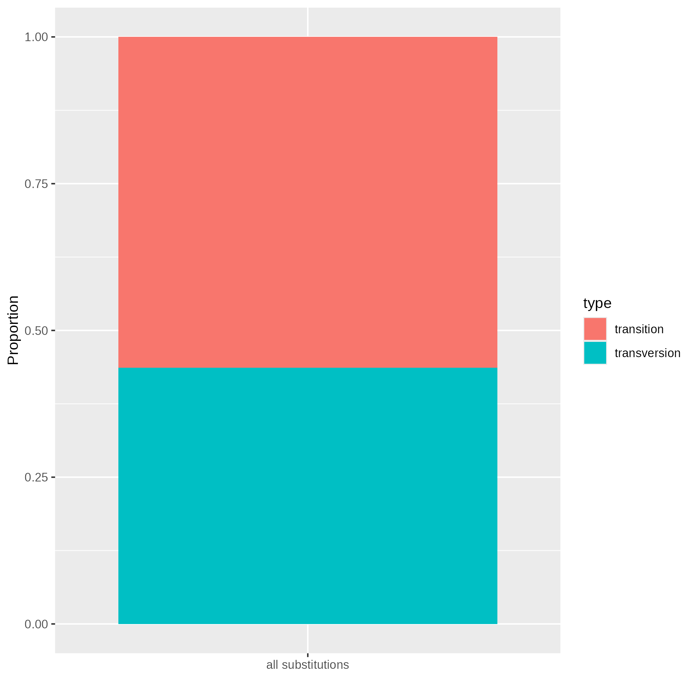
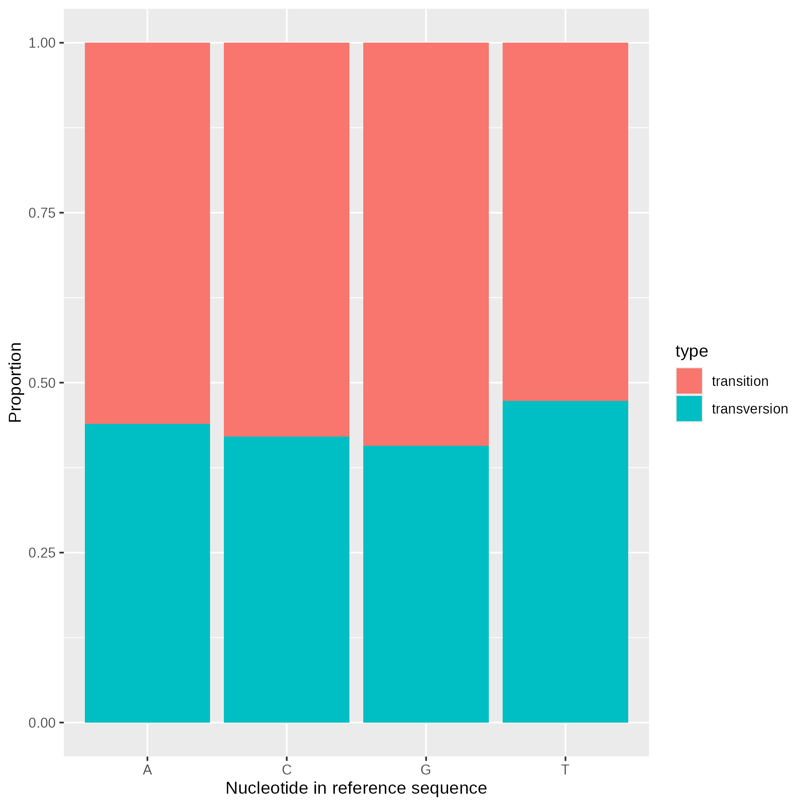

# Unix Course Final Assignment: task 6

**Proportion of transitions (A -> G, G -> A, C -> T, T -> C) and transversions (A -> C/T, C -> A/G, G -> C/T, T -> A/G) in total and by type of nucleotide** 

The proportion of transversions and transitions was analysed using bash script `workflow.sh`. Usage:
```bash
# ./workflow.sh "path-to-data" eg.
./workflow.sh /data-shared/vcf_examples/luscinia_vars.vcf.gz 
```
The script generates tab separated file `results/substitution_type.tsv` with nucleotide in the reference sequence, nucleotide in the alternative sequence, and mutation type (transition or transversion) for each substitution. Plots of the substitution type proportions in total (`all_substitutions.png`) and by nucleotide in the reference sequence (`by_nucleotide.png`) are saved in png format in the same directory.

Explanation of the code:
* `< "$1" zcat`: Loading data from the file specified by first command line argument.
* `cut -f 1-8`:  Removing columns specifying allele variants in studied individuals.
* `grep -v -e "^#" -e "INDEL"`:  Removing headers and rows with indels.
* `awk '{print($4$5)}'`:  Joining of reference and alternative allele info.
* `sed -E "s/(.)(.),(.)/\1\2\n\1\3/" |  sed -E "s/(.)(.),(.)/\1\2\n\1\3/"`:  Splitting info about multiallelic loci into multiple lines (one per each alternative allele; `sed` called twice because of rpesence of loci with three alternative alleles).
* `awk '{if ($1 ==  "AG" || $1 == "GA" || $1 == "CT" || $1 =="TC") print($1, "transition"); else print($1, "transversion");}'`: Based on the combination of the reference and alternative alleles, the substitutions are classified as transitions and transversions.
* `tr " " "\t"`: Changing column separator to `\t`.
* `sed -E "s/^(.)(.)/\1\t\2/"`: Nucleotide types in reference and alternative alleles splitted into separate columns.

## R analalysis

### Proportion of transitions and transversions across all loci:

In the dataset, transitions are more frequent (representing approximately 56.4 % of all substitutions). 

### Proportion of transitions and transversions by type of nucleotide

The highest proportion of transversions was observed in loci with thymine in the reference sequence (ca. 47.3 %), the proportion was similar among the other nucleotides (G: 40.7 %, A: 43.9 %, C: 42.1 %).
